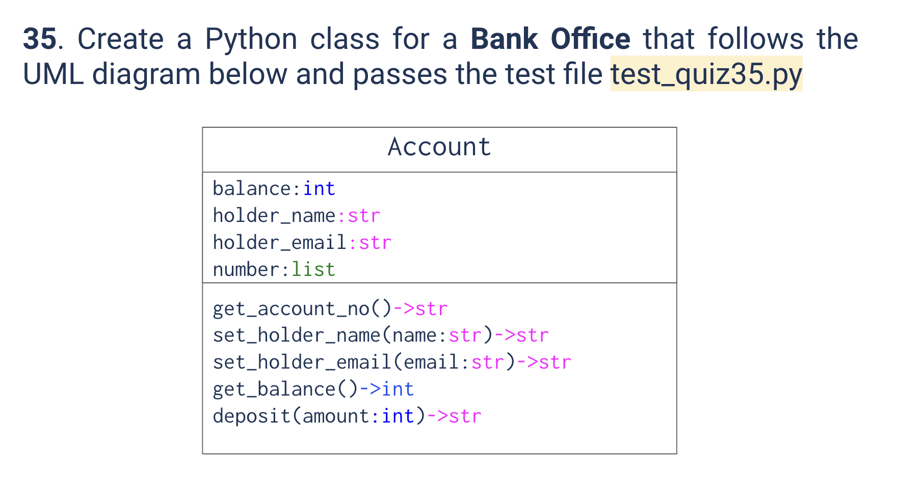

# Quiz 33
<hr>

### Prompt

*fig. 1* **Screenshot of quiz slides**

### Solution
```.py
def mystery(list1:list, list2:list) -> list:
    output = []
    for it in list1:
        for el in list2:
            if it == el:
                output.append(it)
    return output
```

### Evidence

*fig. 2* **Screenshot of output in console when running test file**