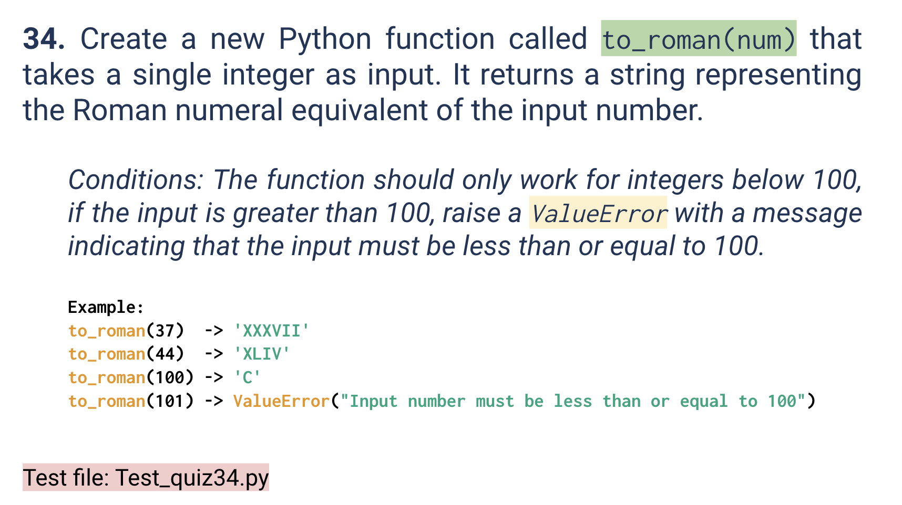
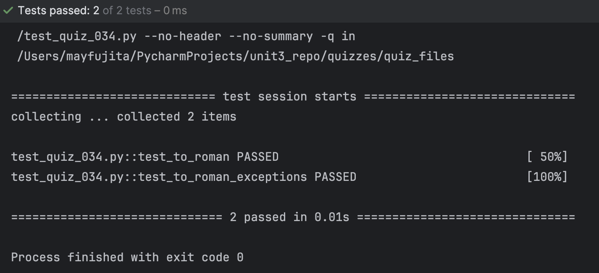

# Quiz 034
<hr>

### Prompt

*fig. 1* **Screenshot of quiz slides**

### Solution
```.py
symbols = {
            100: "C",
            90: "XC",
            50: "L",
            40: "XL",
            10: "X",
            9: "IX",
            5: "V",
            4: "IV",
            1: "I"
        }

def to_roman(num:int):
    if num > 100:
        raise ValueError("Input number must be less than or equal to 100")
    output = ""
    for key in symbols:
        while num >= key:
            output += symbols[key]
            num -= key
    return output
```

### Evidence

*fig. 2* **Screenshot of output in console**