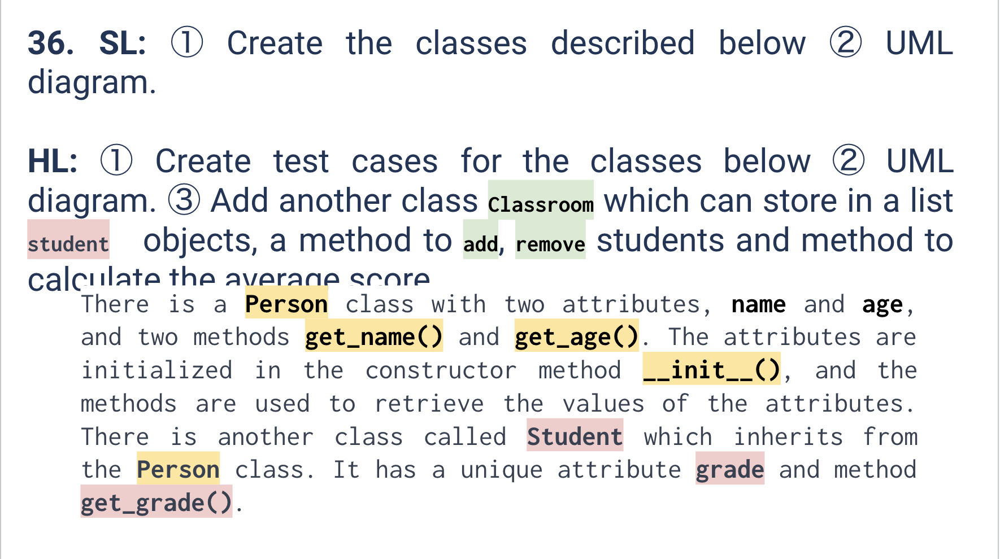

# Quiz 036
<hr>

### Prompt

*fig. 1* **Screenshot of quiz slides**

### Solution
Classes: `quiz_036.py`
```.py
class Person():
    def __init__(self, name, age):
        self.name = name
        self.age = age
    def get_name(self):
        return self.name

    def get_age(self):
        return self.age


class Student(Person):
    def __init__(self, name, age, grade):
        super(Student, self).__init__(name, age)
        self.grade = grade

    def get_grade(self):
        return self.grade


# HL
class Classroom():
    def __init__(self):
        self.students = []

    def add_student(self, student:Student):
        self.students.append(student)
    
    def remove_student(self, student:Student):
        self.students.remove(student)

    def class_average(self):
        sum = 0
        for student in self.students:
            sum += student.get_grade()
        return sum / len(self.students)
```

Testcase: `test_quiz_036.py`
```.py
import pytest
from quiz_036 import Student
from quiz_036 import Classroom

def test_add_student():
    classroom = Classroom()
    student = Student("John", 18, 90)
    classroom.add_student(student)
    assert student in classroom.students

def test_remove_student():
    classroom = Classroom()
    student = Student("John", 18, 90)
    classroom.add_student(student)
    classroom.remove_student(student)
    assert student not in classroom.students

def test_remove_non_existing_student():
    classroom = Classroom()
    student = Student("John", 18, 90)
    with pytest.raises(ValueError):
        classroom.remove_student(student)

def test_get_average_score():
    classroom = Classroom()
    student1 = Student("John", 18, 90)
    student2 = Student("Jane", 19, 80)
    classroom.add_student(student1)
    classroom.add_student(student2)
    assert classroom.class_average() == (90 + 80) / 2

def test_empty_classroom():
    classroom = Classroom()
    with pytest.raises(ValueError):
        classroom.class_average()
```

### Evidence

*fig. 2* **Screenshot of output in console when running test file**

### UML Diagram

*fig. 3* **UML diagram for described classes**