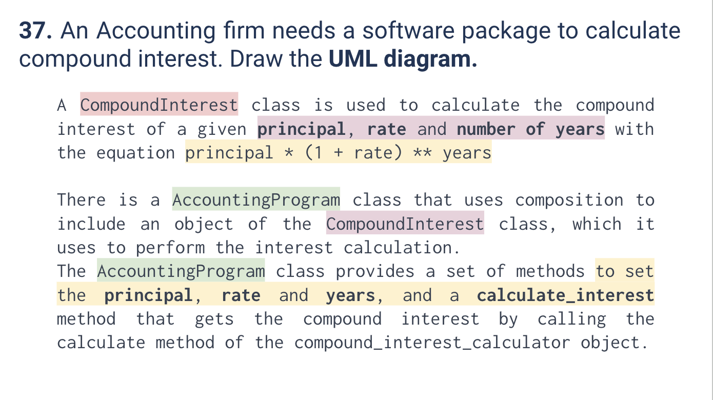
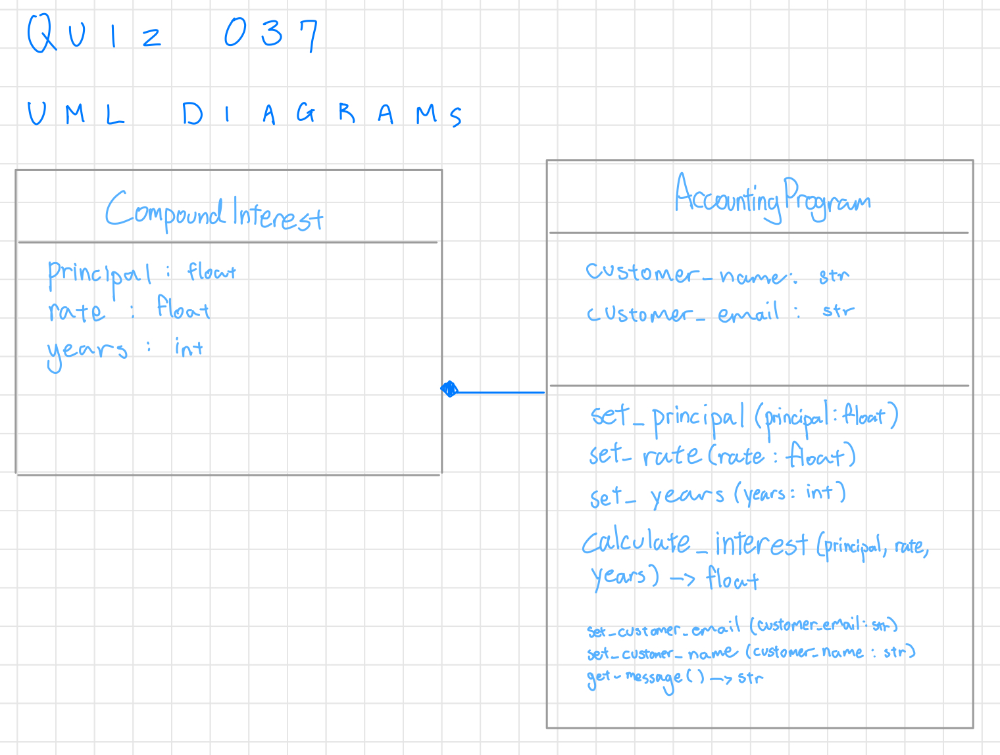
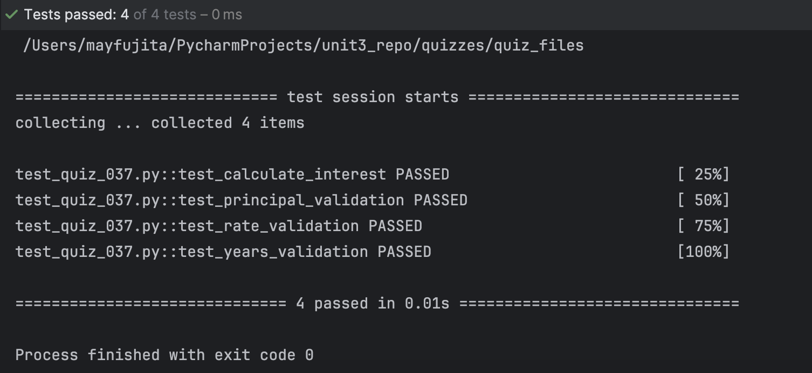

# Quiz 037
<hr>

### Prompt

*fig. 1* **Screenshot of quiz slides**

### Solution
Class:
```.py
class CompoundInterest:
    def __init__(self):
        self.principal = None
        self.rate = None
        self.n_years = None


class AccountingProgram(CompoundInterest):
    def __init__(self): # Customer name and email are attributes given in class but not in quiz slides
        super(AccountingProgram, self).__init__()
        self.customer_name = None
        self.customer_email = None

    def set_principal(self, principal):
        if principal <= 0:
            raise ValueError("Principal should be greater than zero")
        self.principal = principal

    def set_rate(self, rate):
        if not 0 <= rate <= 1:
            raise ValueError("Interest rate should be greater than zero")
        self.rate = rate

    def set_years(self, n_years: int):
        if n_years <= 0:
            raise ValueError("Years should be greater than zero")
        self.n_years = n_years

    def calculate_interest(self):
        return round(self.principal * ((1 + self.rate) ** self.n_years), 2)


    # Below methods given in class but not in quiz slides
    def set_customer_name(self, customer_name):
        self.customer_name = customer_name

    def set_customer_email(self, customer_email):
        self.customer_email = customer_email
    def get_message(self):
        return f"{self.customer_name} will have {self.calculate_interest()} USD in {self.n_years} years if the principal is {self.principal} USD with {self.rate*100}% annual compound interest."
```


*fig. 2* **UML Diagram of described class**

### Evidence

*fig. 3* **Screenshot of output in console when running given test file `test_quiz_037.py`**