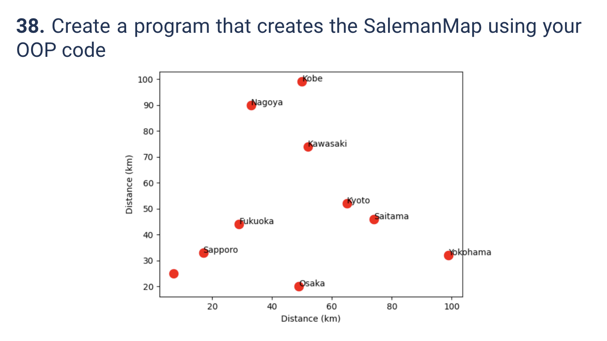
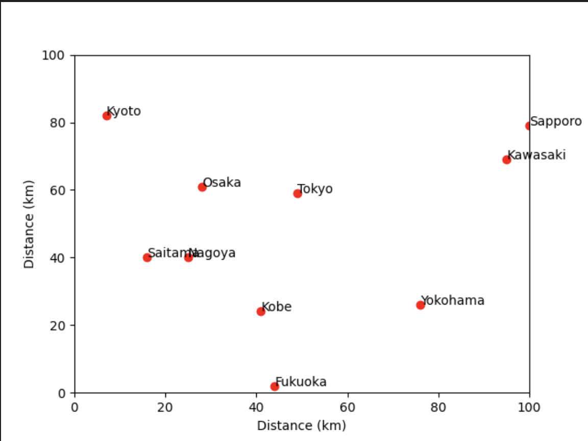

# Quiz 038
<hr>

### Prompt

*fig. 1* **Screenshot of quiz slides**

### Solution
```.py
from matplotlib import pyplot as plt
import random

class SalemanMap:
    def __init__(self):
        self.x = []
        self.y = []
        self.name = None

    def get_map(self):
        for n in range(len(self.name)):
            plt.plot((self.x[n]), (self.y[n]), marker="o", color="red")
            plt.annotate(self.name[n],(self.x[n], self.y[n]))
        plt.xlabel("Distance (km)")
        plt.xlim(0,100)
        plt.ylabel("Distance (km)")
        plt.ylim(0, 100)
        plt.show()

    def generate_data(self, names:list):
        self.name = names
        for i in names:
            self.x.append(random.randint(0,100))
            self.y.append(random.randint(0,100))


test = SalemanMap()
test.generate_data(['Kobe', 'Tokyo', 'Nagoya', 'Kyoto', 'Saitama', "Yokohama", "Osaka", "Sapporo", "Fukuoka", "Kawasaki"])
test.get_map()
```

### Evidence

*fig. 2* **Screenshot of created figure**

### UML Diagram

*fig. 3* **UML Diagram for solution**