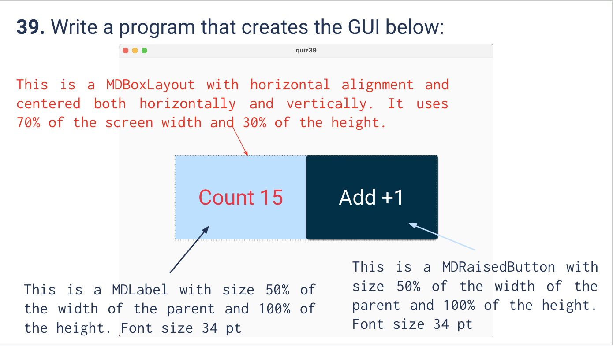
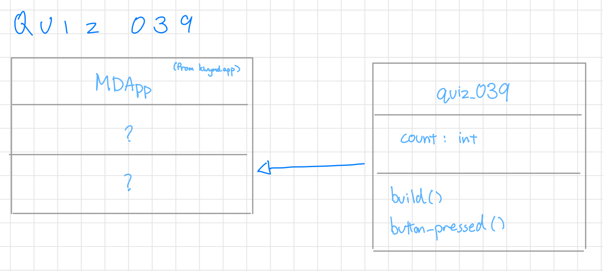

# Quiz 039
<hr>

### Prompt

*fig. 1* **Screenshot of quiz slides**

### Solution
Python code:
```.py
from kivymd.app import MDApp

class quiz_039(MDApp):
    def build(self):
        self.count = 0
        return

    def button_pressed(self):
        self.count += 1
        label = self.root.ids.my_label
        label.text = f"Count {self.count}"

show = quiz_039()
show.run()
```
Kivymd code:
```.kv
Screen:
        size: 1000,1000

        MDBoxLayout:
                id: box_layout
                orientation: "horizontal"
                size_hint: 0.7, 0.3
                pos_hint: {"center_x":0.5, "center_y":0.5}
                halign: "center"
                valign: "center"
                md_bg_color: "#cfeaff"

                MDLabel:
                        id: my_label
                        text: "Count 0"
                        theme_text_color: "Custom"
                        text_color: "red"
                        halign: "center"
                        size_hint: 0.5, 1
                        pos_hint: {"center_x":0.5, "center_y":0.5}
                        font_size: "34pt"

                MDRaisedButton:
                        id: my_button
                        size_hint: 0.5, 1
                        font_size: "34pt"
                        text: "Add +1"
                        md_bg_color: "#263c4d"
                        on_press:
                                app.button_pressed()
```

### Evidence


https://github.com/MayFu2025/unit3_repo/assets/122759229/f7c366c9-d163-4353-81a8-a18516600fc3


*fig. 2* **Video of popup screen**

### UML Diagram

*fig. 3* **UML Diagram for solution**
