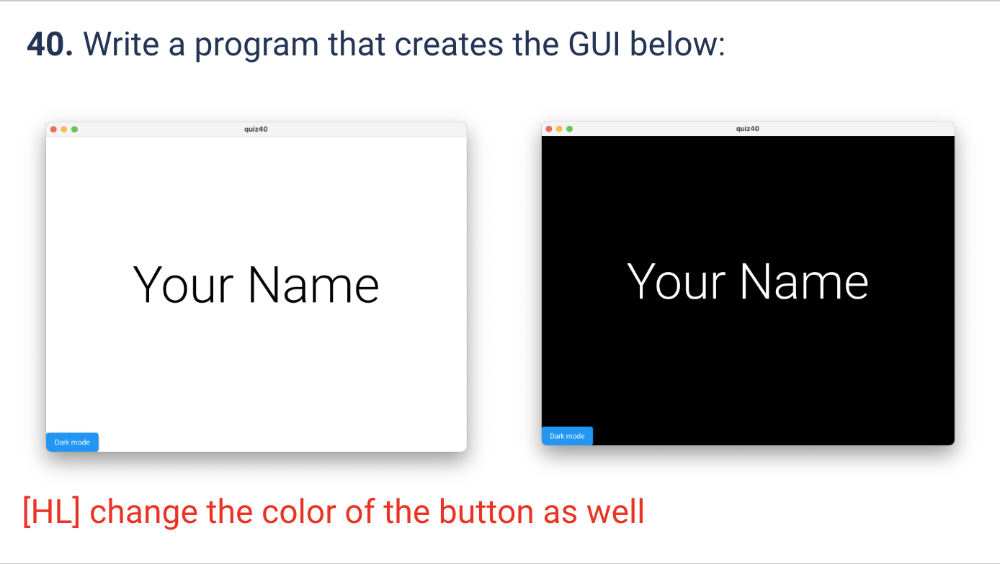
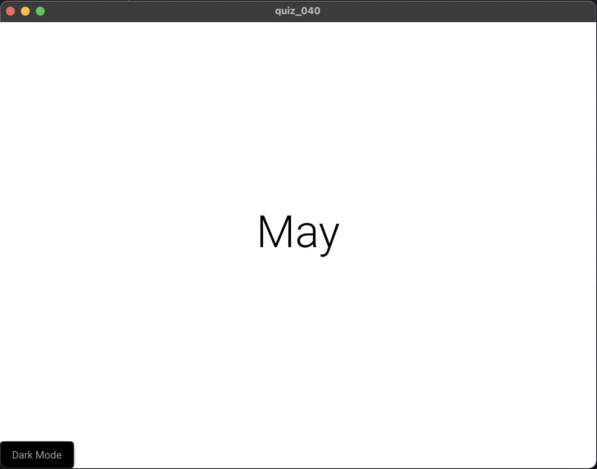
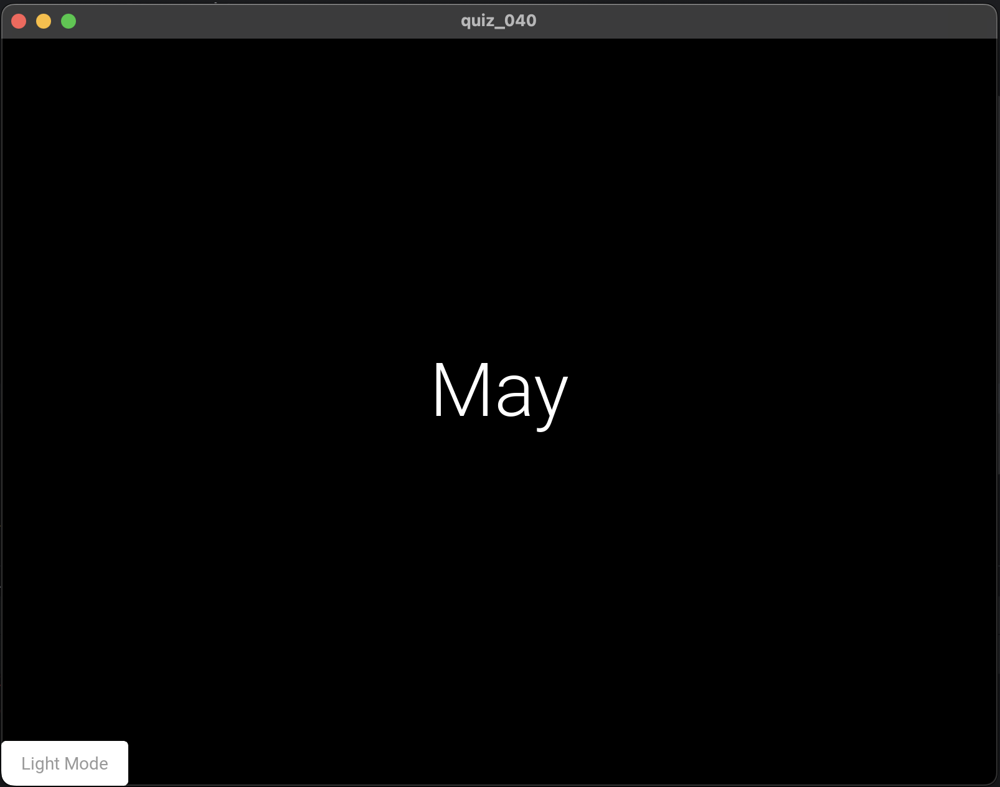

# Quiz 040
<hr>

### Prompt

*fig. 1* **Screenshot of quiz slides**

### Solution
Python code:
```.py
from kivymd.app import MDApp

class quiz_040(MDApp):
    def build(self):
        return

    def button_pressed(self):
        screen = self.root.ids.my_screen
        button = self.root.ids.my_button
        label = self.root.ids.my_label

        if screen.md_bg_color == [0, 0, 0, 1]:
            screen.md_bg_color = "white"
            button.md_bg_color = "black"
            button.text = "Dark Mode"
            label.text_color = "black"
        else:
            screen.md_bg_color = "black"
            button.md_bg_color = "white"
            button.text = "Light Mode"
            label.text_color = "white"


show = quiz_040()
show.run()
```
Kivymd code:
```.kv
MDScreen:
        size: 1000,1000

        MDBoxLayout:
                id: my_screen
                orientation: "vertical"
                size_hint: 1, 1
                pos_hint: {"center_x": .5, "center_y": .5}
                md_bg_color: "white"

                MDLabel:
                        id: my_label
                        text: "May"
                        theme_text_color: "Custom"
                        text_color: "black"
                        font_style: "H2"
                        halign: 'center'
                        pos_hint: {"center_x": .5, "center_y": .5}

                MDRaisedButton:
                        id: my_button
                        pos: 0,0
                        text: "Dark Mode"
                        text_color: "#999999"
                        md_bg_color: "black"
                        on_press:
                                app.button_pressed()
```

### Evidence


*fig. 2* **Screenshots of popup screen, light mode and dark mode**

### UML Diagram

*fig. 3* **UML Diagram for solution**