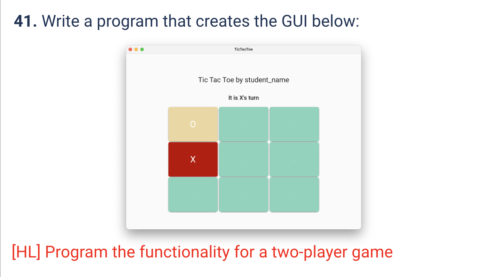
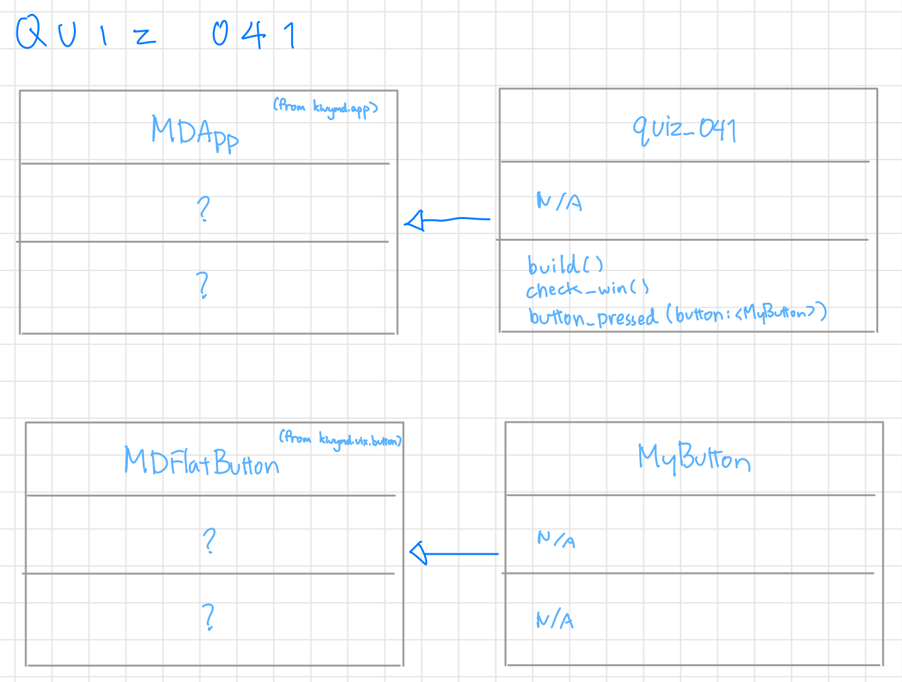

# Quiz 041
<hr>

### Prompt

*fig. 1* **Screenshot of quiz slides**

### Solution
Python code:
```.py
from kivymd.app import MDApp
from kivymd.uix.button import MDFlatButton
from kivy.core.window import Window

class MyButton(MDFlatButton):
    pass

class quiz_041(MDApp):
    def build(self):
        Window.size = (500, 500)
        self.turnA = True
        self.player_a = []
        self.player_b = []
        return

    def check_win(self):
        winner = None
        win = ["123", "456", "789", "147", "258", "369", "159", "357"]
        A = ''.join(self.player_a)
        B = ''.join(self.player_b)
        for i in win:
            if all(pos in A for pos in i):
                winner = "A"
            elif all(pos in B for pos in i):
                winner = "B"
        return winner

    def button_pressed(self, button):
        label = self.root.ids.turn_label
        if self.turnA:
            button.text = "X"
            button.md_bg_color = "#6d95fc"
            label.text = "Player B's Turn"
            self.player_a.append(str(button.name))
        elif not self.turnA:
            button.text = "O"
            button.md_bg_color = "#ffa59e"
            label.text = "Player A's Turn"
            self.player_b.append(str(button.name))
        self.turnA = not self.turnA

        check = self.check_win()
        if check == "A":
            label.text = "Player A Wins!"
            label.text_color = "#6d95fc"
            label.bold = True
            for i in ["1", "2", "3", "4", "5", "6", "7", "8", "9"]:
                self.root.ids[i].disabled = True
        elif check == "B":
            label.text = "Player B Wins!"
            label.text_color = "#ffa59e"
            label.bold = True
            for i in ["1", "2", "3", "4", "5", "6", "7", "8", "9"]:
                self.root.ids[i].disabled = True
        else:
            pass


show = quiz_041()
show.run()
```
Kivy code:
```.kv
Screen:
        MDBoxLayout:
                orientation: 'vertical'
                size_hint: 0.8, 0.8
                pos_hint: {'center_x': 0.5, 'center_y': 0.5}

                MDLabel:
                        text: "TIC TAC TOE by May"
                        halign: 'center'
                        size_hint: 1, 0.2
                        bold: True

                MDLabel:
                        id: turn_label
                        text: "Player A's Turn"
                        halign: 'center'
                        size_hint: 1, 0.1
                        custom_color: True
                        text_color: 0, 0, 0, 1

                MDBoxLayout:
                        orientation: 'horizontal'
                        size_hint: 1, 0.23

                        MyButton:
                                id : 1
                                name: 1
                        MyButton:
                                id : 2
                                name: 2
                        MyButton:
                                id : 3
                                name: 3

                MDBoxLayout:
                        orientation: 'horizontal'
                        size_hint: 1, 0.23

                        MyButton:
                                id : 4
                                name: 4
                        MyButton:
                                id : 5
                                name: 5
                        MyButton:
                                id : 6
                                name: 6

                MDBoxLayout:
                        orientation: 'horizontal'
                        size_hint: 1, 0.23

                        MyButton:
                                id : 7
                                name: 7
                        MyButton:
                                id : 8
                                name: 8
                        MyButton:
                                id : 9
                                name: 9

<MyButton>:
        size_hint: 1, 1
        md_bg_color: '##d6d6d6'
        text_color: "#ffffff"
        on_press:
                app.button_pressed(self)
```

### Evidence
https://github.com/MayFu2025/unit3_repo/assets/122759229/c80cb34a-5025-4285-926b-1821e61a7213
*fig. 2* **Video of popup screen**

### UML Diagram

*fig. 3* **UML Diagram for solution**
