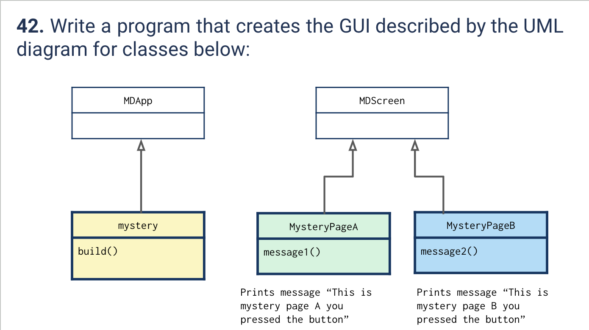

# Quiz 042
<hr>

### Prompt

*fig. 1* **Screenshot of quiz slides**

### Solution
Python code:
```.py
from kivymd.app import MDApp
from kivy.core.window import Window
from kivymd.uix.screen import MDScreen

class quiz_042(MDApp): #Meant to be named mystery
    def build(self):
        Window.size = (400, 700)
        return

class MysteryPageA(MDScreen):
    def message1(self):
        self.parent.current = 'Second'
    pass

class MysteryPageB(MDScreen):
    def message2(self):
        self.parent.current = 'First'

t = quiz_042()
t.run()
```
Kivymd code:
```.kv
ScreenManager:
        MysteryPageA:
                name: 'A'
        MysteryPageB:
                name: 'B'


<MysteryPageA>
        MDLabel:
                pos_hint: {'center_x': 0.5, 'center_y': 0.5}
                halign: 'center'
                text: 'This is mystery page A, you pressed the button!'

        MDFloatingActionButton:
                icon: "arrow-right"
                pos_hint: {'center_x': 0.5, 'center_y': 0.1}
                on_press: root.manager.current = 'B'

<MysteryPageB>
        MDLabel:
                pos_hint: {'center_x': 0.5, 'center_y': 0.5}
                halign: 'center'
                text: 'This is mystery page B, you pressed the button!'

        MDFloatingActionButton:
                icon: "arrow-right"
                pos_hint: {'center_x': 0.5, 'center_y': 0.1}
                on_press: root.manager.current = 'A'
```

### Evidence
https://github.com/MayFu2025/unit3_repo/assets/122759229/df22bfd1-f164-4794-ac04-d61f08d9c829
*fig. 2* **Video of popup screen**
