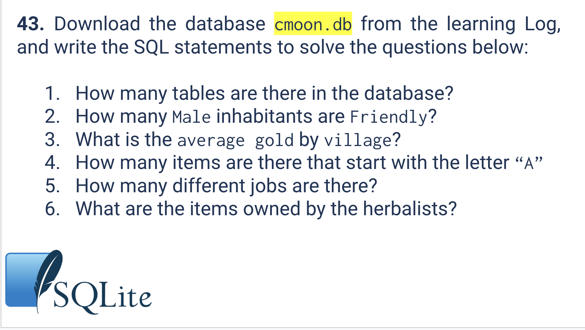
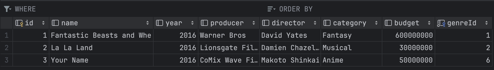

# Quiz 043
<hr>

### Prompt

*fig. 1* **Screenshot of quiz slides**

### Solution
```.sqlite
create table if not exists Genre (
    id integer primary key,
    name varchar
);

insert into Genre(name)
values('Fantasy');

create table if not exists Movies (
    id integer primary key,
    name varchar,
    year int,
    producer varchar,
    director varchar,
    category varchar(100),
    budget real,
    genreId integer not null,
    foreign key (genreId) references genre(id)
);

insert into Movies(name, year, producer, director, category, budget, genreId)
values('La La Land', 2016, 'Lionsgate Films', 'Damien Chazelle', 'Musical', 30000000, (select id from Genre where name = 'Romance'));

insert into Movies(name, year, producer, director, category, budget, genreId)
values('Fantastic Beasts and Where to Find Them', 2016, 'Warner Bros', 'David Yates', 'Fantasy', 600000000, (select id from Genre where name = 'Fantasy'));

insert into Movies(name, year, producer, director, category, budget, genreId)
values('Your Name', 2016, 'CoMix Wave Films', 'Makoto Shinkai', 'Anime', 50000000, (select id from Genre where name = 'Anime'));
```

### Evidence

*fig. 2* **Screenshot of table in database**