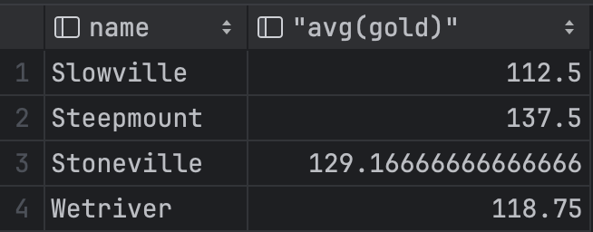

# Quiz 043
<hr>

### Prompt

*fig. 1* **Screenshot of quiz slides**

### Solution
```.sqlite
select count(*) as number_of_tables from sqlite_master where type = 'table';

select count(*) as MaleFriendly from INHABITANT where gender = 'Male' and state = 'Friendly';

select V.name, avg(gold) from INHABITANT join VILLAGE V on INHABITANT.villageid = V.villageid group by V.name;

select count(*) as AItems from ITEM where item like 'A%';

select count(distinct job) from INHABITANT;

select item as HerbalistItems from ITEM it, INHABITANT i where i.job = 'Herbalist' and i.personid = it.owner;
```

### Evidence





*fig. 2* **Screenshots of output in console**

### UML Diagram

*fig. 3* **UML Diagram for solution**