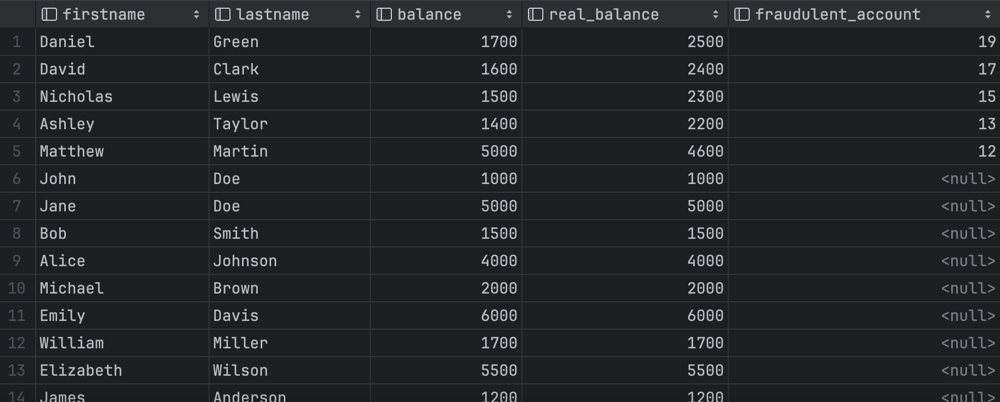
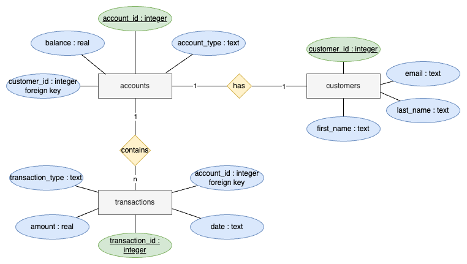

# Quiz 044
<hr>

### Prompt

*fig. 1* **Screenshot of quiz slides**

### Solution
```.sqlite
select firstname, lastname, balance, deposits-withdrawals as real_balance,
case when deposits-withdrawals != balance then account_id end as fraudulent_account
from (select
          transactions.account_id,
          sum(case when transaction_type = 'deposit' then amount else 0 end) as deposits,
          sum(case when transaction_type = 'withdraw' then amount else 0 end) as withdrawals,
          accounts.balance,
          customers.first_name as firstname,
          customers.last_name as lastname
      from transactions join accounts on transactions.account_id = accounts.account_id join customers on accounts.customer_id = customers.customer_id
      group by transactions.account_id) order by fraudulent_account desc;
```

### Evidence

*fig. 2* **Screenshot of output in console. The users where their account id shows on the column "fraudulent_account" are responsible for the bankruptcy.**

### ER Diagram

*fig. 3* **ER Diagram for `cmoon.db`**