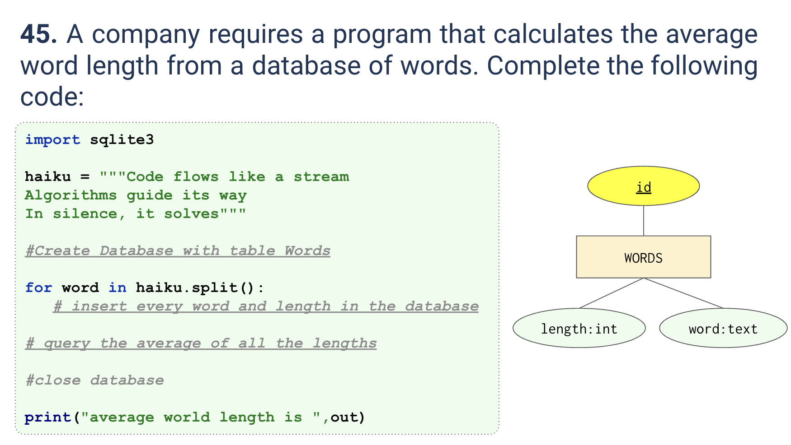

# Quiz 
<hr>

### Prompt

*fig. 1* **Screenshot of quiz slides**

### Solution
```.py
from quiz_lib import DatabaseWorker

haiku = "Code flows like a stream Algorithms guide its way In silence, it solves"

db = DatabaseWorker(name='quiz_045.db')

q_reset = """Drop table if exists Words"""

db.run_query(q_reset)

q_create = """Create table if not exists Words(
        id integer primary key,
        word text,
        length integer)
"""

db.run_query(query=q_create)

for word in haiku.split(' '):
    q_insert = f"""Insert into Words(word, length)
            values('{word}', {len(word)})"""
    db.insert(query=q_insert)

q_avg = "select avg(length) from Words"

print(f"Average word length is {str(db.search(q_avg)).strip('(),')}")

db.close()
```

### Evidence

*fig. 2* **Screenshot of output in console**

### ER Diagram
**Diagram given in quiz slides**