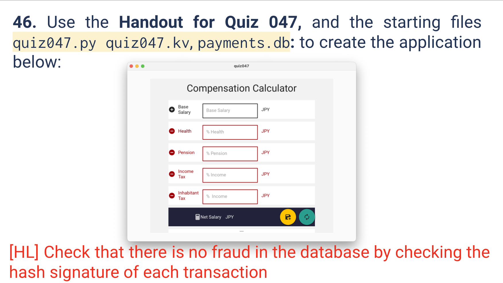

# Quiz 046
<hr>

### Prompt

*fig. 1* **Screenshot of quiz slides**

### Solution
```.py

```

```.kv

```

### Evidence

*fig. 2* **Screenshot of output in console**

### UML Diagram

*fig. 3* **UML Diagram for solution**