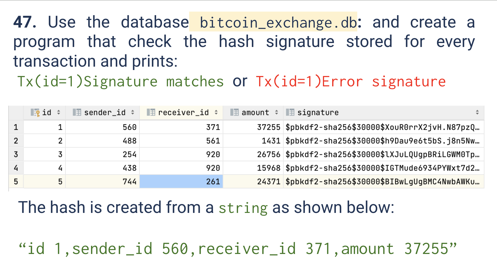
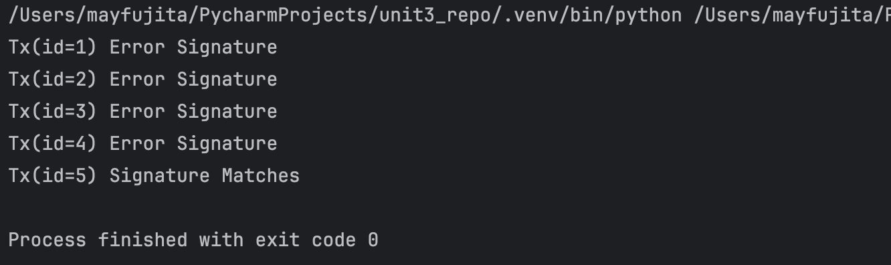

# Quiz 047
<hr>

### Prompt

*fig. 1* **Screenshot of quiz slides**

### Solution
```.py
from quiz_lib import DatabaseWorker, check_text

db = DatabaseWorker(name='bitcoin_exchange.db')
query = "Select * from ledger"
result = db.search(query=query, multiple=True)

for n in result:
    pre_hash = f"id {n[0]},sender_id {n[1]},receiver_id {n[2]},amount {n[3]}"
    if check_text(hashed=n[4], text=pre_hash):
        print(f"Tx(id={n[0]}) Signature Matches")
    else:
        print(f"Tx(id={n[0]}) Error Signature")
```

### Evidence

*fig. 2* **Screenshot of output in console**

### ER Diagram

*fig. 3* **UML Diagram for solution**