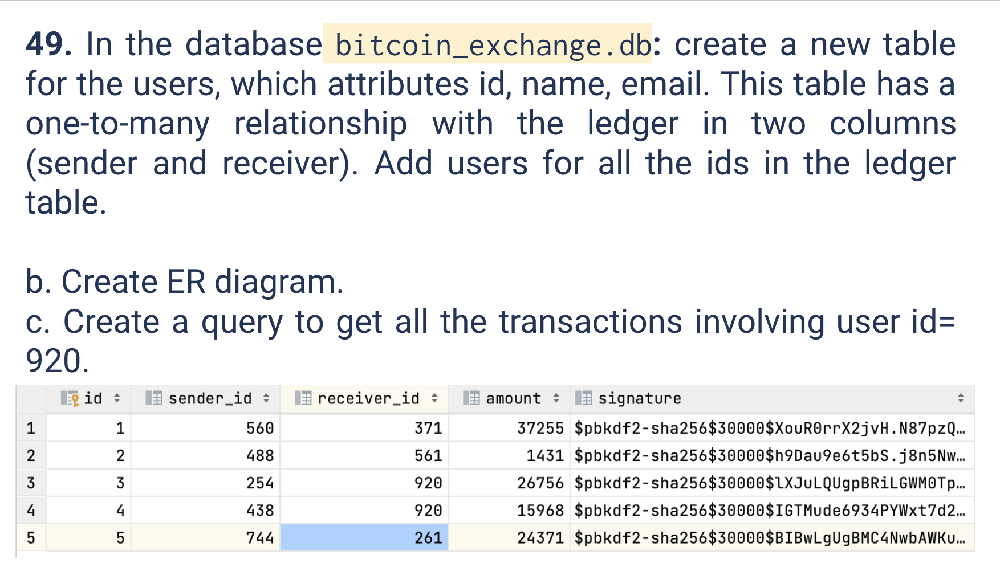

# Quiz 049
<hr>

### Prompt

*fig. 1* **Screenshot of quiz slides**

### Solution
```.sqlite
DROP TABLE if exists users;

Create table if not exists users (id integer foreign_key, name text, email text);

Insert into users (id, name, email) values (560, 'Bob Bobby', 'bob@xyz.com');

Insert into users (id, name, email) values (488, 'Alice Anderson', 'aliceb@xyz.com');

Insert into users (id, name, email) values (254, 'Rachel Rust', 'rachel@xyz.com');

Insert into users (id, name, email) values (438, 'Charlie Charleston', 'charlie@xyz.com');

Insert into users (id, name, email) values (744, 'Jeff Jackson', 'jeff@xyz.com');

Insert into users (id, name, email) values (371, 'Mary Milton', 'mary@xyz.com');

Insert into users (id, name, email) values (561, 'Sam Sanders', 'sam@xyz.com');

Insert into users (id, name, email) values (920, 'Tonia Taylor', 'tonia@xyz.com');

Insert into users (id, name, email) values (261, 'Peter Parker', 'peter@xyz.com');

Select * from ledger where sender_id = 920 or receiver_id = 920;
```

### Evidence

*fig. 2* **Screenshot of output in console**

### ER Diagram

*fig. 3* **ER Diagram for `bitcoin_exchange.db`**