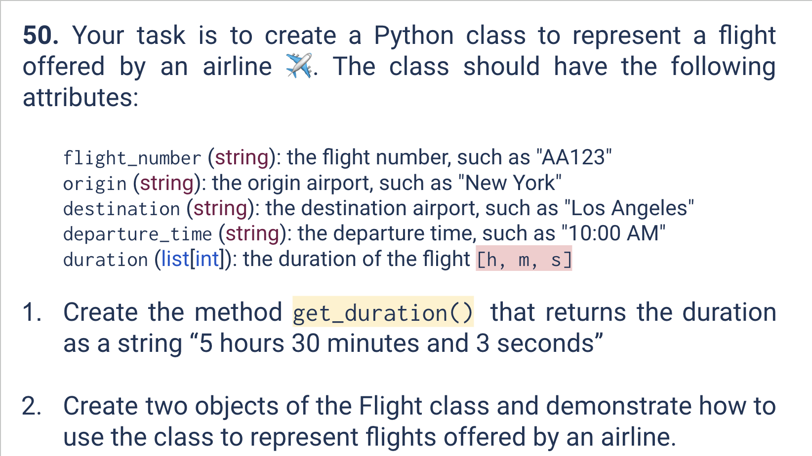
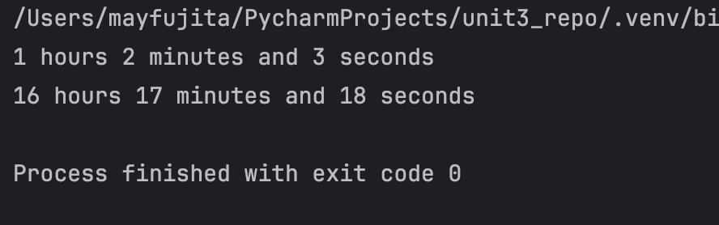

# Quiz 050
<hr>

### Prompt

*fig. 1* **Screenshot of quiz slides**

### Solution
```.py
class Flight:
    def __init__(self, flight_number, origin, destination, departure_time, duration):
        self.flight_number = flight_number
        self.origin = origin
        self.destination = destination
        self.departure_time = departure_time
        self.duration = duration

    def get_duration(self):
        output = f"{self.duration[0]} hours {self.duration[1]} minutes and {self.duration[2]} seconds"
        return output


MaysFlight = Flight('ANA123', 'HND', 'NRT', "2024-02-19, 8:00AM", [1, 2, 3])
print(MaysFlight.get_duration())

BobsFlight = Flight('JAL501', 'NRT', 'KIX', "2024-05-01, 5:30AM", [16, 17, 18])
print(BobsFlight.get_duration())
```

### Evidence

*fig. 2* **Screenshot of output in console**

### UML Diagram

*fig. 3* **UML Diagram for solution**